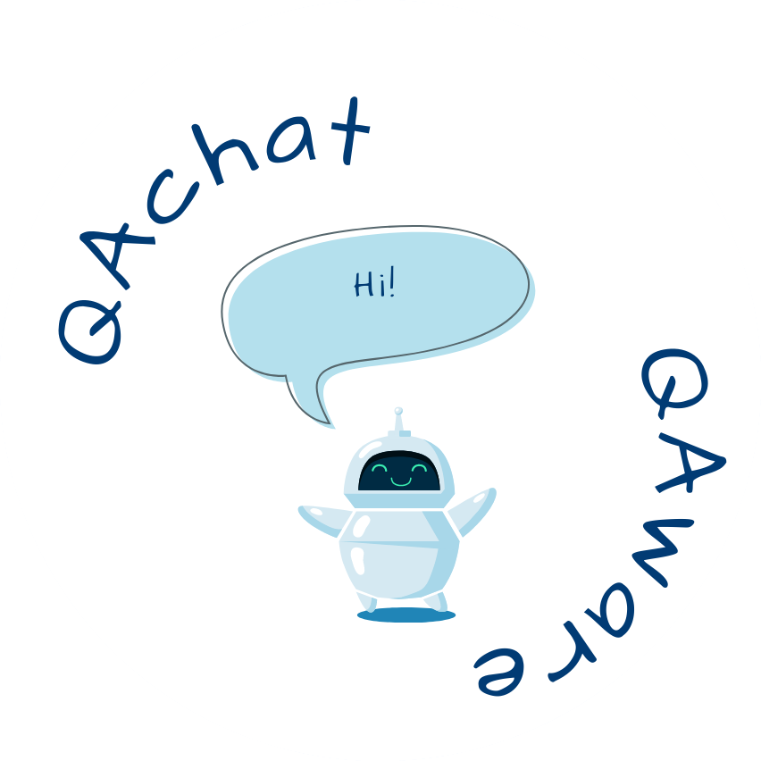

# QAChat in Cooperation with QAWARE (AMOS SS 2023)
Something something something

  

## Quicklinks
- [About](#About)
- [Vision](#Vision)
- [Setup](#Setup)
- [Documentation](#Documentation)
- [Chatbot (Needs Edit)](/QAChat/)

## About
*QAChat* evaluates newly developed LLMs for the use in a chatbot. The best suited network is trained on provided data that is collected from existing communication and documentation sources. The model is available for users to ask questions through a Slack bot integration.

## Vision
In recent times, LLMs have evolved rapidly, opening up new, previously unimagined areas of application. *QAChat* takes advantage of these developments to provide users with a simple and convenient point of contact. This allows a general language model to be trained on specific knowledge and thus answer context-specific questions through an interface integrated into an already used communication tool.

## Setup
1. )

## Documentation
- For the Team Google Sheet go to: [Google Sheet](https://docs.google.com/spreadsheets/d/1YPjbiAhNvHcSZrW76hD67fqGCg3-shARfk5d4C8jOtA)

- For other Documentation go to: [Documentation Folder](/Documentation/README.md)

